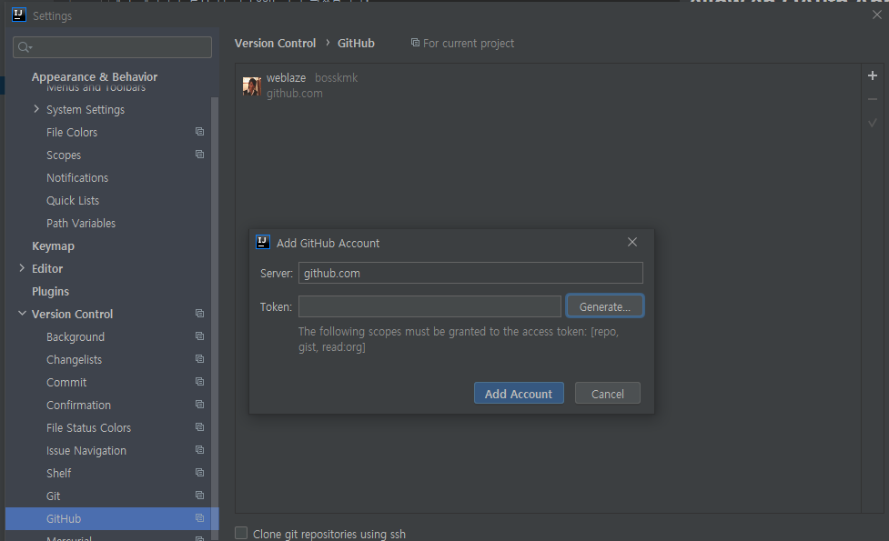

### [Common] Intellij(Windows) 에서 Github workflows 파일의 Push 에러. "refusing to allow an OAuth App to create or update workflow"

오늘(2020년 11월 18일) IntelliJ 에서 Github 로 Push 를 했는데 "refusing to allow an OAuth App to create or update workflow" 와 같은 
에러 메시지가 발생하면서 Push 오류가 발생하였습니다.  

다른 파일들은 push 가 되었는데 github 의 actions 파일인 .github/workflows 파일이 포함 되어있을 때만 발생 했습니다.

Github 에서 Windows 인증 방식을 변경하여 발생 된 문제 입니다.

제 경우는 일단 Windows 용 Git 을 업데이트 했습니다.

```bash
git update-git-for-windows
```

그리고 IntelliJ 에서 기존의 Github 인증을 삭제하고 새로 추가 했습니다.



IntelliJ 의 Settings 에 보시면 위와 같이 Version Control > Github 를 찾으실 수 있습니다.
기존 계정정보를 삭제하고 우측에 + 버튼을 클릭하신 후 Login with token 을 클릭하시면, Generate 버튼이 있는
다이얼로그가 나타 납니다.  

그 Generate 버튼을 클릭하시면 Github 페이지가 열리고 저장 하신 후 생성 된 Token 을 입력해서 다시 시도하시면 됩니다.
다만, <strong>workflow 설정에 체크가 안되어 있으므로 workflow 파일을 push 하시려면 token 생성 할 때 체크</strong> 하셔야 합니다.


참고 링크  
* https://stackoverflow.com/questions/64059610/how-to-resolve-refusing-to-allow-an-oauth-app-to-create-or-update-workflow-on
* https://park-jongseok.github.io/git/2019/10/06/installing-and-updating-git.html
