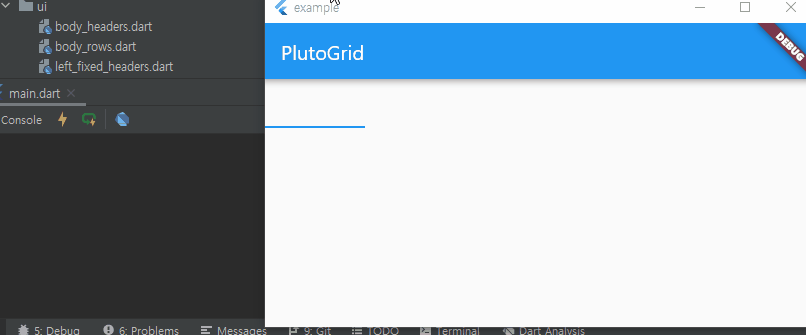
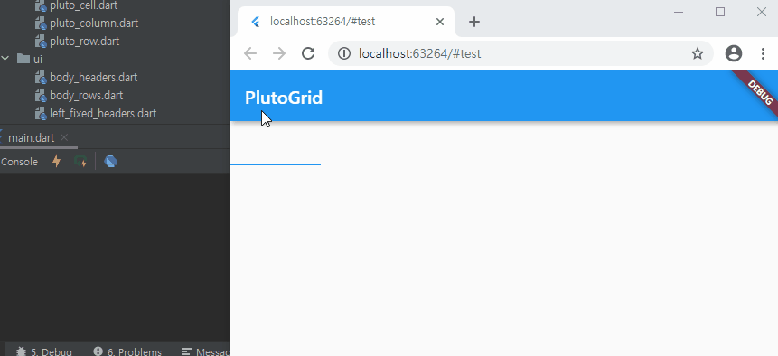

### [Flutter] RawKeyboardListener 를 중첩해서 사용 할 때 TextField 에서 엔터키 차이

오늘 flutter upgrade 를 하고 두 가지 차이점을 발견했습니다.

첫 번째는 RawKeyEvent 에서 logicalKey.keyLabel 값을 반환 할 때 기존에는 null 이 "" 빈 문자열로 변경 되었습니다.

두 번째는 아래 예제를 작성해놓은 문제 입니다.

RawKeyboardListener 를 중첩해서 사용 할 때 TextField 에서 엔터키를 입력하게 되면
Desktop 에서는 first, second 로그가 잘 찍히는데 Web 에서는 둘 다 찍히지 않습니다.

> PlutoGrid 의 실제 코드에서는 중첩 된 두번 째 RawKeyboardListener 의 콜백만 동작 합니다. 실제 코드와 예제와의 어떤 차이가 이런 문제를 발생시키는지 아직 잘 모르겠습니다.

때문에 TextField 에 textInputAction: TextInputAction.none, 속성을 추가해서 원하는 동작을 구현하였습니다.
아래 예제에는 주석 처리 되어있는데 주석 해제를 하면 두 개의 FocusNode 콜백이 모두 호출 되어 first, second 로그가 출력 됩니다.

아래 예제와 이미지 첨부 했습니다.

```dart
class _TestState extends State<Test> {
  FocusNode _textFocus;

  @override
  void dispose() {
    _textFocus.dispose();
    super.dispose();
  }

  @override
  void initState() {
    _textFocus = FocusNode();
    super.initState();
  }
  final firstFocus = FocusNode(onKey: (FocusNode focusNode, RawKeyEvent event) {
    print('first');
    return false;
  });

  final secondFocus =
      FocusNode(onKey: (FocusNode focusNode, RawKeyEvent event) {
    print('second');
    return false;
  });

  @override
  Widget build(BuildContext context) {
    _textFocus.requestFocus();

    return Scaffold(
      appBar: AppBar(
        title: Text('PlutoGrid'),
      ),
      body: RawKeyboardListener(
        focusNode: firstFocus,
        child: Container(
          width: 100,
          height: 80,
          child: RawKeyboardListener(
            focusNode: secondFocus,
            child: TextField(
              focusNode: _textFocus,
              // textInputAction: TextInputAction.none,
              readOnly: true,
              onTap: () {
                print('tap');
              },
              onSubmitted: (String value) {
                print('submitted');
              },
            ),
          ),
        ),
      ),
    );
  }
}
```

### Desktop 에서


### Web 에서
